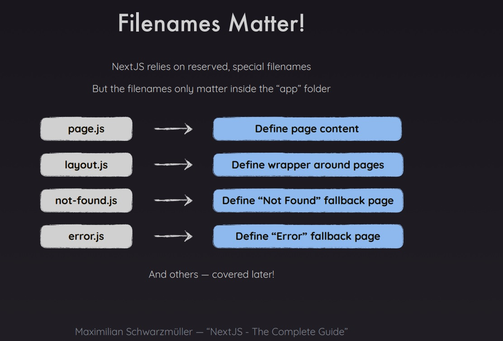

# Ejercicio 2

## Getting Started

First, run the development server:

```bash
npm run dev
# or
yarn dev
# or
pnpm dev
# or
bun dev
```

Open [http://localhost:3000](http://localhost:3000) with your browser to see the result.

You can start editing the page by modifying `app/page.tsx`. The page auto-updates as you edit the file.

This project uses [`next/font`](https://nextjs.org/docs/basic-features/font-optimization) to automatically optimize and load Inter, a custom Google Font.

## Como Funciona la app

Es una app que demuestra las partes esenciales de next js teniendo como principio el Routing, se recomienda ver la imagen 001 de los slides para entender lo que se busca con las rutas


## Temas tratados

- Routing
- Reserved Name Files
- Basic setup with HTML tag and HEAD metadata

## Tips

- El routing solo funciona dentro de la carpeta app
- Layout y Page son palabras reservadas de next js para el enrutamiento



- Se toca el tema de server components y segun dice maximilliam, page.tsx es parte del server, esto se confirma ya que si se utiliza el console.log, no se va a ver en la consola del browser sino en el servidor de desarrollo.
- Cada folder dentro de APP es una ruta despues del slash "/" en la ruta del navegador, pero no por si solo, se debe agregar una page.tsx para que next js reconozca la nueva ruta.
- Se explica que para los links de enrutamiento interno y que la pagina permanezca siendo una SPA, se utiliza el componente LINK del propio Next js.
- Se explica que se necesita en todo projecto al menos un layout.tsx file.
- En layout se observa un HTML tag que lo que hace es crear una especie de pagina independiente para la pagina en cuestion.
- Los datos del HEAD en el layout no se encuentran dentro del HTML tag sino en una constante llamada METADATA
- Icon.png es otra palabra reservada de next js y se va a utilizar como el favicon de la pagina.
- La importancia de tener una archivo llamado page dentro de cada carpeta es para que next js lo reconozca como una pagina, si por ejemplo creamos una carpeta llamada components y ponemos los componentes ahi, next js no los va a reconocer como pages sino como componentes que se pueden exportar e importar normalmente como en react.

- [Link a los docs de Next js para ver las palabras de archivo reservadas](https://nextjs.org/docs/app/api-reference/file-conventions)

- Maximilliam lo que hace es tener los componentes por fuera de app para tener solo routing en app
- Se puede utilizar la @ en los path para que Next js los reconozca como root.
- Dinamic Routes: SI por ejemplo se desea un blog, pero para no tener que hacer un archivo por cada uno de los blogs que se vayan generando, lo que se hace es utilizar los [] en el nombre de la carpeta para indicar a next js que se va a utilizar la misma pagina pero con links a diferentes componentes que den diferente informacion, para esto existe un **props** que next js pasa que se llama **params**, entonces en el componente del post del blog lo que se hace es decir que se utiliza los params.[aqui va lo que esta dentro de esto en el nombre del folder]. Entonces como cada carpeta es una ruta lo que se hace con los [] es decirle a next js que esa es una ruta que va a tener muchas sub-rutas, pero estas sub-rutas por dentro no va a ser mas carpetas, un arrume de carpetas, sino componentes funcionales que es mas facil tener por montones.

  - Lo que se hace es que en el page.tsx que esta al lado de la carpeta [], se colocan los links a los diferentes paths de cada post.
  - Entonces la idea es tener un referente para futuras paginas que no se sabe que nombre o cuantas van a ser.
  - Entonces cada componente dentro de la carpeta [] va a recibir el params que hace que ese mismo componente cambie de acuerdo a lo que el page.tsx padre le diga para asi renderizar diferentes paginas con el mismo mini template.
  - Params.slug es el nombre de la ruta que esta definida dinamicamente en ese momento.
  