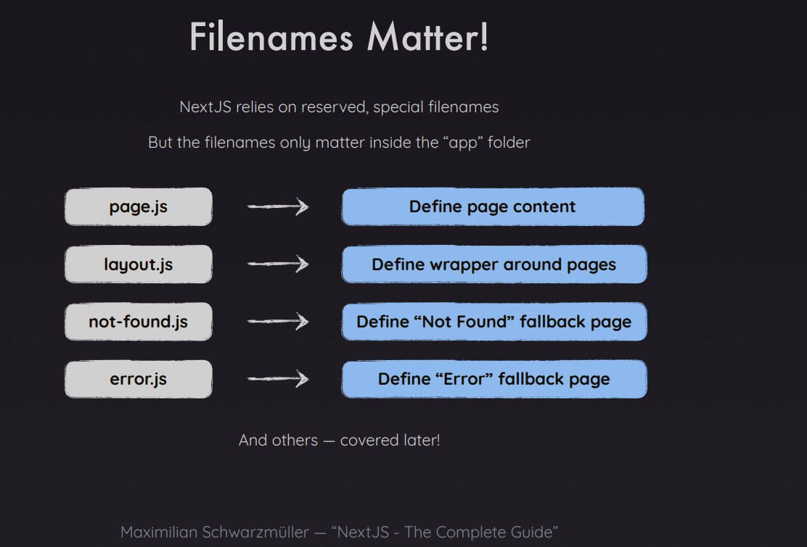

# Ejercicio 2

## Getting Started

First, run the development server:

```bash
npm run dev
# or
yarn dev
# or
pnpm dev
# or
bun dev
```

Open [http://localhost:3000](http://localhost:3000) with your browser to see the result.

You can start editing the page by modifying `app/page.tsx`. The page auto-updates as you edit the file.

This project uses [`next/font`](https://nextjs.org/docs/basic-features/font-optimization) to automatically optimize and load Inter, a custom Google Font.

## Como Funciona la app

Es una app que demuestra las partes esenciales de next js teniendo como principio el Routing, se recomienda ver la imagen 001 de los slides para entender lo que se busca con las rutas


## Temas tratados

- Routing

## Tips

- El routing solo funciona dentro de la carpeta app
- Layout y Page son palabras reservadas de next js para el enrutamiento



- Se toca el tema de server components y segun dice maximilliam, page.tsx es parte del server, esto se confirma ya que si se utiliza el console.log, no se va a ver en la consola del browser sino en el servidor de desarrollo.
- Cada folder dentro de APP es una ruta despues del slash "/" en la ruta del navegador, pero no por si solo, se debe agregar una page.tsx para que next js reconozca la nueva ruta.
- Se explica que para los links de enrutamiento interno y que la pagina permanezca siendo una SPA, se utiliza el componente LINK del propio react.
