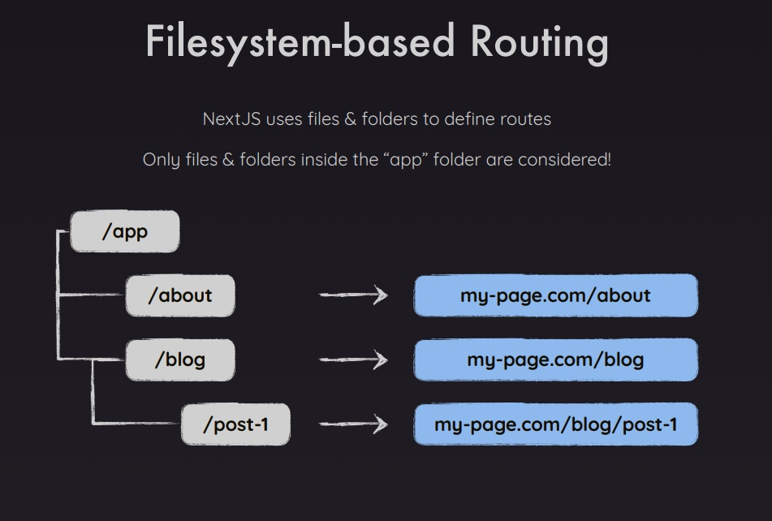

# Ejercicio 2

## Getting Started

First, run the development server:

```bash
npm run dev
# or
yarn dev
# or
pnpm dev
# or
bun dev
```

Open [http://localhost:3000](http://localhost:3000) with your browser to see the result.

You can start editing the page by modifying `app/page.tsx`. The page auto-updates as you edit the file.

This project uses [`next/font`](https://nextjs.org/docs/basic-features/font-optimization) to automatically optimize and load Inter, a custom Google Font.

## Como Funciona la app

Es una app que demuestra las partes esenciales de next js teniendo como principio el Routing, se recomienda ver la imagen 001 de los slides para entender lo que se busca con las rutas



## Temas tratados

- Routing

## Tips

- El routing solo funciona dentro de la carpeta app
